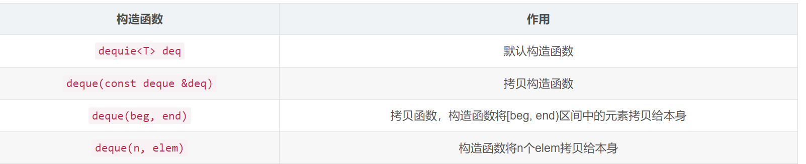

---
title: stl_learn
cover: OIP.jpeg
tags:
---

##stl fundemental
```动态数组
int *p = new int[n]
```
加大储存空间：
1.新申请一个较大的内存空间，即执行
```
int * temp = new int[m];
```
2.将原内存空间的数据全部复制到新申请的内存空间中，即执行
```
memecpy(temp, p, sizeof(int)*n);
```
3.将原来的堆空间释放，即执行
```
delete [] p; p = temp;
```
当采用stl向量模板类vector实现以上功能：
```
vector <int> a; //定义 a 数组，当前数组长度为 0，但和普通数组不同的是，此数组 a 可以根据存储数据的数量自动变长。
//向数组 a 中添加 10 个元素
for (int i = 0; i < 10 ; i++)
    a.push_back(i)
//还可以手动调整数组 a 的大小
a.resize(100);
a[90] = 100;
//还可以直接删除数组 a 中所有的元素，此时 a 的长度变为 0
a.clear();
//重新调整 a 的大小为 20，并存储 20 个 -1 元素。
a.resize(20, -1)
```
push_back( ) 成员函数在向量的末尾插入值，如果有必要会扩展向量的大小。
size( ) 函数显示向量的大小。
begin( ) 函数返回一个指向向量开头的迭代器。
end( ) 函数返回一个指向向量末尾的迭代器。
###泛型
```
T maxt(T x, T y){
      return (x>y)?x :y;
}
```
T 是占位符，为泛型
##vector
```
#define _CRT_SECURE_NO_WARNINGS
#include<iostream>
#include<vector>
#include<algorithm>
using namespace std;
 
//STL 中的容器 算法 迭代器
void test01()
{
    vector<int> v; //STL 中的标准容器之一 ：动态数组
    v.push_back(1); //vector 容器提供的插入数据的方法
    v.push_back(5);
    v.push_back(3);
    v.push_back(7);
    //迭代器
    vector<int>::iterator pStart = v.begin(); //vector 容器提供了 begin()方法 返回指向第一个元素的迭代器
    vector<int>::iterator pEnd = v.end(); //vector 容器提供了 end()方法 返回指向最后一个元素下一个位置的迭代器
    //通过迭代器遍历
    while (pStart != pEnd){
        cout << *pStart << " ";
        pStart++;
    }
    cout << endl;
    //算法 count 算法 用于统计元素的个数
    int n = count(pStart, pEnd, 5);
    cout << "n:" << n << endl;
}
//STL 容器不单单可以存储基础数据类型，也可以存储类对象
class Teacher
{
public:
    Teacher(int age) :age(age){};
    ~Teacher(){};
public:
    int age;
};
void test02(){
    vector<Teacher> v; //存储 Teacher 类型数据的容器
    Teacher t1(10), t2(20), t3(30);
    v.push_back(t1);
    v.push_back(t2);
    v.push_back(t3);
    vector<Teacher>::iterator pStart = v.begin();
    vector<Teacher>::iterator pEnd = v.end();
    //通过迭代器遍历
    while (pStart != pEnd){
        cout << pStart->age << " ";
        pStart++;
    }
    cout << endl;
}
//存储 Teacher 类型指针
void test03()
{
    vector<Teacher*> v; //存储 Teacher 类型指针
    Teacher* t1 = new Teacher(10);
    Teacher* t2 = new Teacher(20);
    Teacher* t3 = new Teacher(30);
    v.push_back(t1);
    v.push_back(t2);
    v.push_back(t3);
    //拿到容器迭代器
    vector<Teacher*>::iterator pStart = v.begin();
    vector<Teacher*>::iterator pEnd = v.end();
    //通过迭代器遍历
    while (pStart != pEnd){
        cout << (*pStart)->age << " ";
        pStart++;
    }
    cout << endl;
}
//容器嵌套容器 难点
void test04()
{
    vector< vector<int> > v;
    vector<int>v1;
    vector<int>v2;
    vector<int>v3;
 
    for (int i = 0; i < 5;i++)
    {
        v1.push_back(i);
        v2.push_back(i * 10);
        v3.push_back(i * 100);
    }
    v.push_back(v1);
    v.push_back(v2);
    v.push_back(v3);
 
    for (vector< vector<int> >::iterator it = v.begin(); it != v.end();it++)
    {
        for (vector<int>::iterator subIt = (*it).begin(); subIt != (*it).end(); subIt ++)
        {
            cout << *subIt << " ";
        }
        cout << endl;
    }
} 
int main()
{
    //test01();
    //test02();
    //test03();
    test04();
    system("pause");
    return EXIT_SUCCESS;
}
```
##deque容器
deque容器是连续的空间，至少逻辑上看来如此，连续现行空间总是令我们联想到array和vector,array无法成长，vector虽可成长，却只能向尾端成长，而且其成长其实是一个假象，事实上(1) 申请更大空间 (2)原数据复制新空间 (3)释放原空间 三步骤，如果不是vector每次配置新的空间时都留有余裕，其成长假象所带来的代价是非常昂贵的。

deque是由一段一段的定量的连续空间构成。一旦有必要在deque前端或者尾端增加新的空间，便配置一段连续定量的空间，串接在deque的头端或者尾端。Deque最大的工作就是维护这些分段连续的内存空间的整体性的假象，并提供随机存取的接口，避开了重新配置空间，复制，释放的轮回，代价就是复杂的迭代器架构。
既然deque是分段连续内存空间，那么就必须有中央控制，维持整体连续的假象，数据结构的设计及迭代器的前进后退操作颇为繁琐。Deque代码的实现远比vector或list都多得多。




##stack


## queue


##list
双向链表
```
#include<algorithm>
#include<iostream>
#include<vector>
using namespace std;
struct ListNode
{
	int data;
	ListNode* next;//结构体指针
};
void Listprintf(ListNode* phead)
{
	ListNode* cur=phead;
	while (cur != NULL)
	{
		cout << cur->data << "->";
		cur = cur->next;
	}
}
void Listpushback(ListNode** pphead, int x)
{
	ListNode* newnode = new ListNode{ x,NULL };
	if (*pphead == NULL)
	{
		*pphead = newnode;
	}
	else
	{
		ListNode* tail=  *pphead;
		while(tail->next != NULL)
		{
			tail = tail->next;
		}
		tail->next = newnode;
	}
}
void test_1()
{
	ListNode* phead = NULL;
	Listpushback(&phead, 1);
	Listpushback(&phead, 2);
	Listpushback(&phead, 3); 
	Listprintf(phead);
}
int main()
{
	test_1();
	return 0;
}
```

##二叉树
```
//二叉树的节点
class Linknode
{
public：
    linknode(); //构造函数
    int data;
    Linknode* left; //左节点
    Linknode* right;  //右节点	
};
Linknode::linknode()
{
	left =NULL;
	right =Null;
}
class Tree
{
	Linknode* root; //创建二叉树的根
	
}
```
##map
map的特性是，所有元素都会根据元素的键值自动排序。
map所有的元素都是关联的,同时拥有实值和键值（key,value），第一元素被视为键值，第二元素被视为实值，map不允许两个元素有相同的键值.
map中的key是唯一的。集合中元素按照一定顺序排列。元素的插入按照规则插入我，所以不能指定插入位置。
map的底层是红黑树的变体，平衡二叉树。在插入操作、删除和检索上要比vector快很多。
map可以直接存取key所对应的value，支持[]操作符，如map[key]=value.
#include<map>
map支持唯一键值，每个键只能出现一次；而multimap中相同键可以出现多次。multimap不支持[]操作符
###map和set的区别是：
Map对象保存键值对。任何值(对象或者原始值) 都可以作为一个键或一个值。构造函数Map可以接受一个数组作为参数。
Set对象允许你存储任何类型的值，无论是原始值或者是对象引用。它类似于数组，但是成员的值都是唯一的，没有重复的值。
